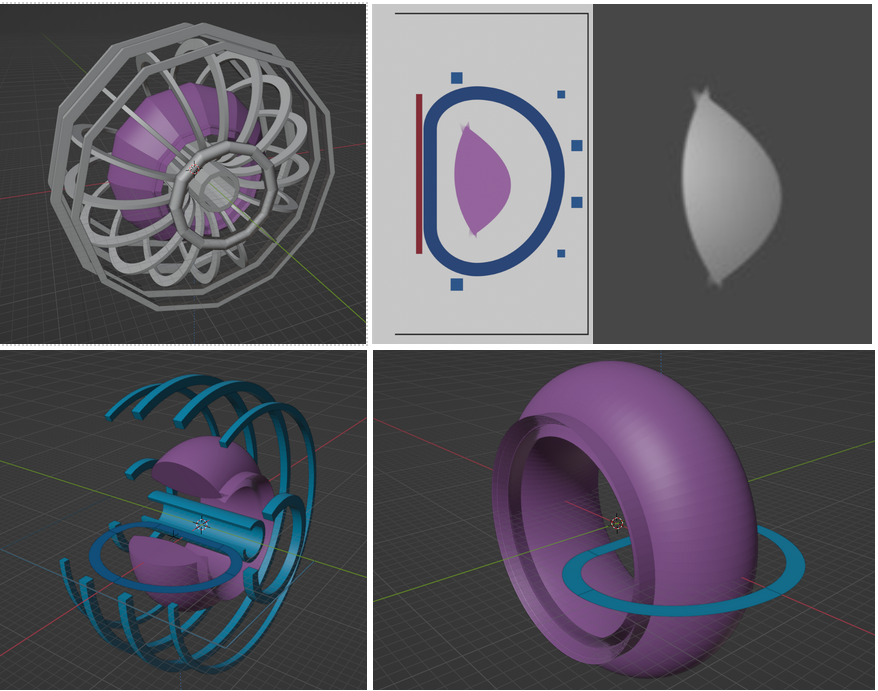

# **FusRR**

**Fus**ion **R**eactor **R**enderer



## Developing visualisations of fusion reactors

The aim of this repository is to take outputs from ``PROCESS`` and `BLUEMIRA` and render them to be able to produce useful visualisations in Blender.

## Setup

This project required Git LFS, install it on Ubuntu:

```bash
apt install git-lfs
```

Git LFS is commonly part of Git and installed along with it.

This project uses [Hatch](https://hatch.pypa.io/latest/).

Although any Python environment manager can be used, we recommend using the default environment setup by Hatch.

To get bpy module types, install the following dependencies:

```bash
pip install fake-bpy-module-4.3
```

For the latest version of `bpy` you can use:

```bash
pip install fake-bpy-module-latest
```

### Without Hatch

1
Setup and activate your environment with your chosen Python environment manager (pyenv, conda, virtualenv, etc.)

Run the following to install this project as a local editable install, with the necessary optional dependency groups:

```bash
pip install -e '.[dev,test,lint]'
```

### With Hatch

To start using Hatch, it must be installed and accessible from the command line. See the Hatch [installation](https://hatch.pypa.io/latest/install/) for more.

A simple way to install Hatch is to run:

```bash
pip install hatch
```

If you can run `hatch -h` then Hatch has been successfully installed.

We recommend setting the `dirs.env` in your hatch config to the following:

```toml
[dirs.env]
virtual = ".hatch"
```

The path to this file can be found by running:

```bash
hatch config find
```

It makes it easier to set the path to environment in your code editor.

Then run:

```bash
hatch shell
```

This will create the default hatch environment in the project folder.

Then set the path to your Python environment in your editor to `.hatch/fusrr/bin/python`

## Installing PROCESS

After your environment has been setup, you will need to install PROCESS.

Make sure your environment is active, clone [PROCESS](https://github.com/ukaea/PROCESS) and follow the install [instructions](https://ukaea.github.io/PROCESS/installation/installation-ubuntu/).

In summary you need to run the following:

```bash
sudo apt update
sudo apt install -y cmake gfortran python3-pip lcov poppler-utils python3-venv

git clone https://github.com/ukaea/PROCESS
cd PROCESS

cmake -S . -B build
cmake --build build

# make sure you have your FUSRR Python environment active
pip install -e .
```

## Tests

Run

```bash
hatch run test:tests
```

## Licence Information

**FusRR** is [released under the MIT License](LICENCE)
